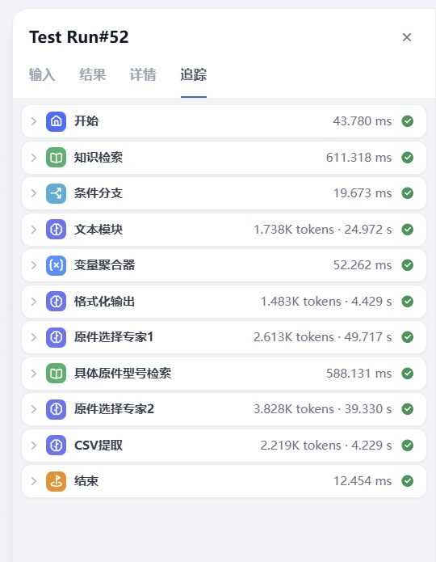
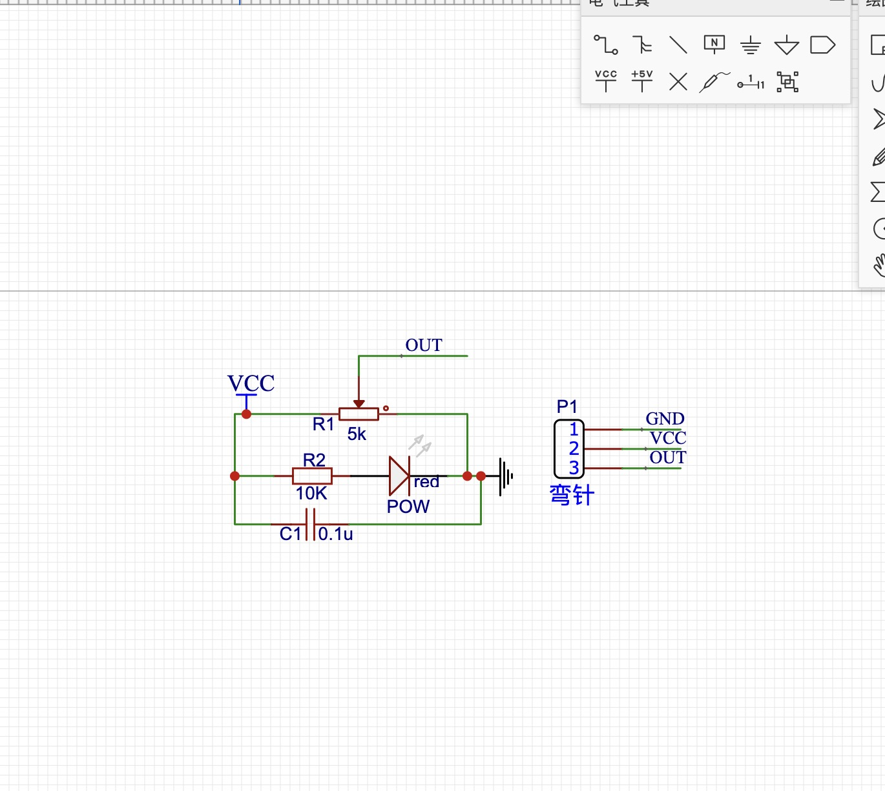
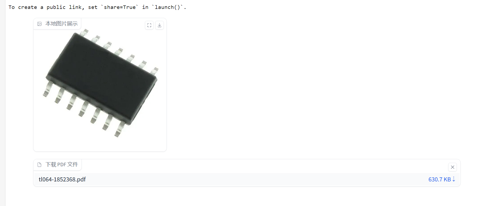
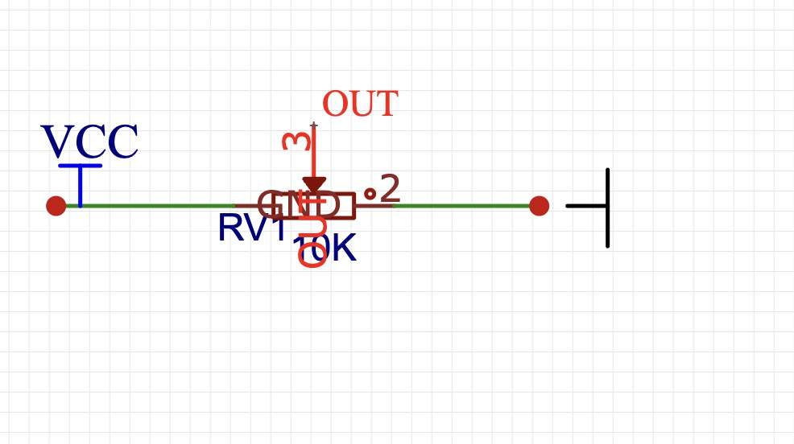
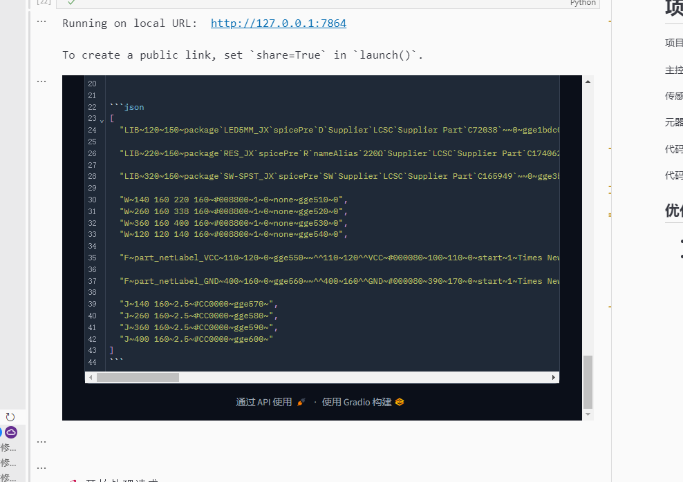

# 第十一届Sky Hackathon


## 参赛项目书

- 参赛学校：清华大学
- 参赛队名： MVP
- 指导老师：李锡涵
- 团队成员：张振尧 王海翔 白乐航 范瑶 何佳蕊

- 项目介绍视频地址：<https://github.com/CircuitGen/PCBTool/blob/main/video.mp4>

## PCBTool.AI

### 《硬件开发的“iPhone时刻”：AI一键生成电路，突破硬件开发不可能的“达芬奇密码”》

副标题：清华MVP团队用PCBTool.ai，赋予大模型硬件开发“上帝模式”

电路设计领域长期存在的专业门槛、研发周期长、试错成本高等痛点严重制约了创新速度。据麦肯锡数据，全球电子产品研发投入每年超过5000亿美元，其中约40%的成本和时间消耗在电路设计环节。特别是在智能制造、新能源、医疗电子等新兴领域，对电路设计效率的需求愈发迫切。为突破这一瓶颈，我们开发了一款基于大规模语言模型的智能电路工程生成系统。该系统整合了深度学习、知识图谱和自动化设计等前沿技术，实现了从需求理解到工程交付的全流程智能化：

### 电路工程生成系统

- **多模态理解**：融合NLP和计算机视觉技术，支持文本、图像等多种形式的需求输入
- **知识增强推理**：构建包含数十万电路设计案例的知识库，结合RAG技术实现精准的设计决策
- **并行方案生成**：基于蒙特卡洛树mcts-llm搜索，同时生成多个可行方案并进行多维度对比
- **全周期自动化**：覆盖原理图设计、元器件选型、代码生成、文档制作等全部环节
- **可解释性设计**：提供详实的设计推理过程，支持交互式方案优化

### 基于NVIDIA NIM大语言模型构建的系统核心，我们实现了

1. 精确的领域知识理解与推理能力
2. 高效的多方案生成和对比分析
3. 接近专家水平的设计评审质量
4. 显著的成本和时间节省

### 本项目致力于

- 降低智能硬件创新门槛，加速产品从概念到产品化的过程
- 提升工程师设计效率，实现设计知识的传承与复用
- 为电子工程教育提供智能化工具支持
- 推动智能制造领域的数字化转型

### 通过本系统的规模化应用，我们期望能够

- 将电子产品的研发周期缩短50%以上
- 降低80%以上的设计试错成本
- 使电路设计门槛降低到高中生可掌握的水平

在"中国制造2025"和全球智能化浪潮的背景下，本项目将为智能硬件创新提供强有力的工具支持，推动电子技术的普及与创新发展。

## PCBTool.ai 技术创新点

### 1. 多模态融合的智能理解

- **双模态输入理解**
  - 支持文本和图像双模态输入，通过NIM模型进行多模态特征融合
  - 针对电路图像开发专门的图像预处理管道，提高元器件识别准确率
  - 使用Prompt Engineering优化模型对专业领域知识的理解能力

- **知识增强的智能推理**
  - 构建超过一万个电路设计案例的知识库
  - 利用RAG技术实现知识检索增强的推理能力
  - 支持跨语言、跨领域的电路知识理解和迁移

### 2. 创新的电路设计算法

- **并行方案生成**
  - 基于蒙特卡洛树搜索(MCTS)的电路方案生成算法
  - 同时生成多个可行方案并进行多维度对比
  - 支持成本、性能、可靠性等多目标优化

- **智能元器件选型**
  - 开发基于深度学习的元器件兼容性检查系统
  - 实现自动化的BOM清单生成和优化
  - 集成全球主流电子元器件供应链数据

### 3. 自动化工程生成

- **全流程自动化**
  - 从需求文档到工程文件的端到端自动化生成
  - 支持原理图、PCB布局、代码等多种工程文件格式
  - 自动生成详细的部署文档和教程

- **代码智能生成**
  - 基于需求自动生成符合规范的嵌入式代码
  - 支持多种主控平台（Arduino、ESP32等）
  - 集成代码质量检查和优化建议

### 4. 交互式设计优化

- **实时反馈机制**
  - 开发基于Gradio的交互式Web界面
  - 支持实时预览和方案调整
  - 提供详细的设计推理过程可视化

- **智能成本优化**
  - 集成多个电子元器件交易平台的实时价格数据
  - 自动推荐最优性价比的元器件组合
  - 支持预算约束下的方案优化

### 5. NVIDIA生态深度集成

- **NIM模型优化**
  - 针对电路设计领域对NIM模型进行微调
  - 使用TensorRT实现推理加速

- **分布式计算支持**
  - 利用NVIDIA NCCL实现多GPU训练
  - 支持模型并行和数据并行
  - 优化大规模知识库的检索效率

我们的系统通过这些创新，实现了电路设计全流程的智能化和自动化，显著提升了设计效率和质量。

## PCBTool.ai 项目技术说明

本项目主要利用NVIDIA NIM大语言模型构建了一个全流程的电路设计辅助系统。通过与NIM API的深度集成，实现了多模态输入理解和多形式内容生成：

### 1. 需求理解与文档生成

- **输入形式**：支持文本描述和图片输入
- **处理流程**：
  - 利用NIM的多模态能力识别和理解用户输入
  - 通过提示词工程将非结构化需求转换为标准格式
  - 生成包含项目名称、描述、主控类型、传感器需求等完整的需求文档

```python
completion = client.chat.completions.create(
    model="deepseek-ai/deepseek-r1",
    messages=[{"role": "user", "content": prompt}],
    temperature=0.3,
    top_p=0.7
)
```

### 2. 电路设计与元器件选型

- **RAG增强推理**：
  - 构建包含元器件数据、电路案例的知识库
  - 通过NIM检索和分析相关案例
  - 智能推荐最优元器件组合

- **输出形式**：生成标准化的BOM表格文件

```csv
元器件型号,元器件种类,数量
Arduino Uno R3,主控芯片,1
5mm LED,执行器,6
220Ω 1/4W Resistor,无源器件,6
```

### 3. 电路图与代码生成

- **可视化输出**：
  - 利用schemdraw库自动生成电路原理图
  - 支持交互式电路图预览和修改

- **代码生成**：
  - 基于需求文档自动生成嵌入式代码
  - 包含完整的引脚定义和功能实现
  - 支持代码注释和使用说明

### 4. 部署文档生成

- **多模态输出**：
  - 文本格式的详细部署指南
  - 语音格式的指导说明（通过gTTS实现）
  - 图文结合的接线教程

```python
def generate_deployment_guide(requirement_doc, bom_data):
    prompt = f"""【部署指南生成提示】
    基于以下需求文档：{requirement_doc}
    以及BOM数据：{bom_data}
    请生成500字左右的详细部署指南..."""
    
    completion = client.chat.completions.create(
        model="deepseek-ai/deepseek-r1",
        messages=[{"role": "user", "content": prompt}]
    )
```

### 5. 交互式界面集成

基于Gradio框架构建了直观的Web界面，实现了：

#### 界面布局设计

- **模块化分区**：划分输入区、分析区、代码区、部署区四大功能模块
- **响应式布局**：通过gr.Row()和gr.Column()实现自适应显示
- **层级清晰**：使用gr.Markdown添加分隔线和标题标识

#### 视觉体验优化

- **专业配色方案**
  - 科技蓝(#1565C0)主色调
  - 浅灰(#F5F5F5)背景色
  - 绿色(#4CAF50)强调色
- **动态交互反馈**
  - 进度条动画
  - 按钮点击效果
  - 实时数据更新

#### 核心功能展示

- 深度推理进度实时展示
- 多方案并行对比分析
- 成本估算和优化建议
- 电路图实时预览
- 代码同步显示
- 一键生成完整工程文件

## 团队介绍

我们是一支充满激情和专业实力的跨学科团队,汇集了人工智能、电子工程、视觉设计等多个领域的专业人才:

- **张振尧** (项目负责人)
  - 在校创业者,中关村高新技术企业创始人
  - 主导项目整体架构设计
  - 负责核心电路设计算法研发

- **王海翔** (技术负责人)  
  - 视觉中国签约摄影师
  - 优化自动化设计流程
  - 构建电路领域知识图谱

- **白乐航** (算法专家)
  - 知名游戏公司算法负责人
  - 设计并行方案生成算法
  - 负责多模态模型训练

- **范瑶** (全栈工程师)
  - CS专业研究生
  - 负责UI/UX设计实现
  - 主导数据治理工作

- **何佳蕊** (领域专家)
  - 清华大学集成电路专业研究生
  - 优化电路设计算法
  - 提供专业领域知识支持

- **指导老师：李锡涵（Xihan Li）**
  - 《简明的 TensorFlow 2》作者
  - 谷歌开发者专家
  - Circuit Transformer作者

## 总结与展望

### 1. 收获

- **AI应用开发**：
  - 深入学习了NVIDIA NIM的Prompt工程和RAG应用
  - 掌握了大模型在专业领域的微调和知识注入技术
  - 实践了多模态模型在工程领域的具体应用
  
- **电路设计自动化**：
  - 掌握了电路原理图的程序化生成方法
  - 学会了使用schemdraw等专业库进行可视化
  - 建立了完整的元器件知识库管理系统

- **工程实践**：
  - 完成了从需求理解到代码生成的全流程开发
  - 实现了基于Gradio的交互式Web应用开发
  - 提升了项目架构设计和工程化能力

### 2. 遗憾

- 比赛周期较短，部分高级功能未能完全实现
- 元器件数据库的覆盖范围还需扩充
- 受限于计算资源，无法进行更大规模的模型训练
- 项目预算有限，难以尝试更多高端元器件方案

### 3. 希望

- 期待AI技术能真正降低电路设计门槛
- 帮助更多学生快速入门电路设计,推动创客教育和STEAM课程发展
- 降低智能硬件创新的试错成本,助力2025"中国制造"向"中国创造"转型
