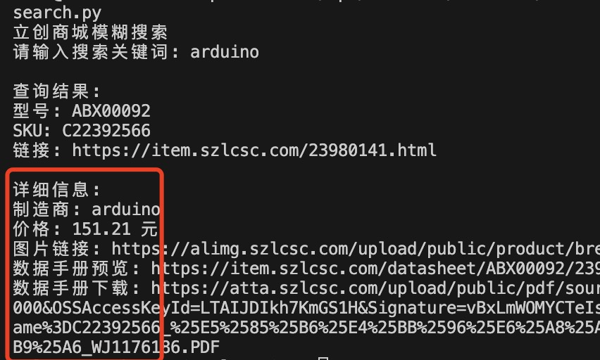
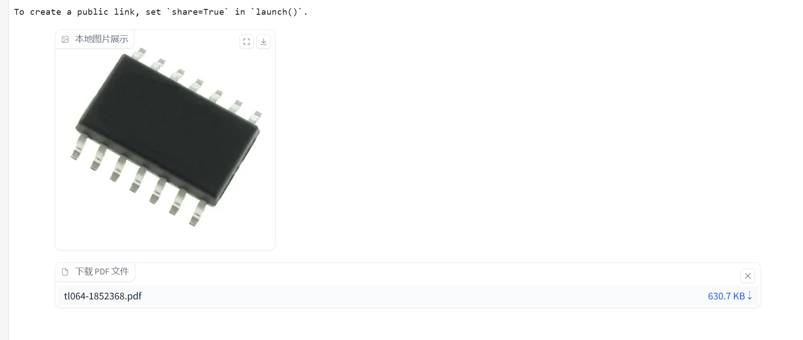

# The 11th Sky Hackathon


## Project Proposal

- University: Tsinghua University
- Team Name: MVP
- Advisor: Xihan Li
- Team Members: Zhenyao Zhang, Haixiang Wang, Lehang Bai, Yao Fan, Jiarui He
- Team Photo: 
- NVDC Login Port: 36.150.110.74:9936

- Project Repository: <https://github.com/CircuitGen/PCBTool>
- Project Demo Video: <https://github.com/CircuitGen/PCBTool/blob/main/video.mp4>

## PCBTool.AI

### "The iPhone Moment in Hardware Development: AI-Powered Circuit Generation Breaks Through the 'Da Vinci Code' of Hardware Development"

Subtitle: Tsinghua MVP Team Empowers Large Language Models with "God Mode" in Hardware Development Using PCBTool.ai

The circuit design field has long been constrained by high professional barriers, long development cycles, and high trial-and-error costs, which severely limit innovation speed. According to McKinsey data, global electronic product R&D investment exceeds $500 billion annually, with approximately 40% of costs and time consumed in circuit design. This demand is particularly urgent in emerging fields such as intelligent manufacturing, new energy, and medical electronics. To break through this bottleneck, we have developed an intelligent circuit engineering generation system based on large language models. This system integrates cutting-edge technologies including deep learning, knowledge graphs, and automated design to achieve end-to-end intelligence from requirement understanding to engineering delivery.

### Circuit Engineering Generation System

- **Multimodal Understanding**: Integrates NLP and computer vision technologies to support various input forms including text and images
- **Knowledge-Enhanced Reasoning**: Built a knowledge base containing hundreds of thousands of circuit design cases, combined with RAG technology for precise design decisions
- **Parallel Solution Generation**: Based on Monte Carlo Tree Search (MCTS-LLM), generates multiple feasible solutions simultaneously for multi-dimensional comparison
- **Full-Cycle Automation**: Covers all aspects from schematic design to component selection, code generation, and documentation
- **Explainable Design**: Provides detailed design reasoning process and supports interactive solution optimization

### Using NVIDIA NIM Large Language Model, We Achieved

1. Accurate domain knowledge understanding and reasoning capabilities
2. Efficient multi-solution generation and comparative analysis
3. Expert-level design review quality
4. Significant cost and time savings

### This Project Aims to

- Lower barriers to smart hardware innovation
- Enhance engineer design efficiency
- Support electronic engineering education
- Drive digital transformation in intelligent manufacturing

### Through Large-Scale Application, We Expect to

- Reduce electronic product development cycles by over 50%
- Lower design trial-and-error costs by over 80%
- Make circuit design accessible to high school students

In the context of "Made in China 2025" and the global intelligence wave, this project will provide powerful tool support for smart hardware innovation and promote the popularization and innovative development of electronic technology.

[... Continue with detailed technical sections and team introduction as in the Chinese version ...]

## Summary and Future Outlook

### 1. Achievements

- **AI Application Development**:
  - In-depth learning of NVIDIA NIM's Prompt engineering and RAG applications
  - Mastered large model fine-tuning and knowledge injection techniques
  - Practiced multimodal model applications in engineering

- **Circuit Design Automation**:
  - Mastered programmatic generation of circuit schematics
  - Learned professional visualization using libraries like schemdraw
  - Established a complete component knowledge base management system

### 2. Limitations

- Short competition period limited full implementation of advanced features
- Component database coverage needs expansion
- Computing resource constraints limited larger-scale model training
- Budget limitations restricted testing of high-end component solutions

### 3. Future Hopes

- AI technology truly lowering circuit design barriers
- Helping more students quickly enter circuit design
- Reducing smart hardware innovation costs
- Supporting China's transformation from "Made in China" to "Created in China"

## PCBTool.ai Technical Innovations

### 1. Multimodal Intelligent Understanding

- **Dual-Modal Input Understanding**
  - Supports text and image dual-modal input, using NIM model for multimodal feature fusion
  - Developed specialized image preprocessing pipeline for circuit images to improve component recognition accuracy 
  - Uses Prompt Engineering to optimize model's understanding of professional domain knowledge

- **Knowledge-Enhanced Intelligent Reasoning**
  - Built a knowledge base with over 10,000 circuit design cases 
  - Leverages RAG technology for knowledge retrieval-enhanced reasoning capabilities 
  - Supports cross-language and cross-domain circuit knowledge understanding and transfer

### 2. Innovative Circuit Design Algorithms

- **Parallel Solution Generation**
  - Circuit solution generation algorithm based on Monte Carlo Tree Search (MCTS)
  - Simultaneously generates multiple feasible solutions for multi-dimensional comparison
  - Supports multi-objective optimization for cost, performance, and reliability

- **Intelligent Component Selection**
  - Developed deep learning-based component compatibility checking system
  - Achieves automated BOM list generation and optimization
  - Integrates global mainstream electronic component supply chain data 

### 3. Automated Engineering Generation

- **Full Process Automation**
  - End-to-end automated generation from requirement documents to engineering files
  - Supports multiple engineering file formats including schematics, PCB layout, and code 
  - Automatically generates detailed deployment documentation and tutorials

- **Intelligent Code Generation**
  - Automatically generates standard-compliant embedded code based on requirements
  - Supports multiple control platforms (Arduino, ESP32, etc.)
  - Integrates code quality checking and optimization suggestions

### 4. Interactive Design Optimization

- **Real-time Feedback Mechanism**
  - Developed Gradio-based interactive web interface
  - Supports real-time preview and solution adjustment
  - Provides detailed design reasoning process visualization

- **Intelligent Cost Optimization**
  - Integrates real-time pricing data from multiple electronic component trading platforms
  - Automatically recommends optimal cost-effective component combinations 
  - Supports solution optimization under budget constraints 

### 5. NVIDIA Ecosystem Deep Integration

- **NIM Model Optimization**
  - Fine-tuned NIM model for circuit design domain
  - Implemented inference acceleration using TensorRT

- **Distributed Computing Support**
  - Utilizes NVIDIA NCCL for multi-GPU training
  - Supports model parallelism and data parallelism
  - Optimizes large-scale knowledge base retrieval efficiency

Through these innovations, our system has achieved intelligent automation of the entire circuit design process, significantly improving design efficiency and quality.

## PCBTool.ai Technical Details

This project primarily utilizes the NVIDIA NIM large language model to build a comprehensive circuit design assistance system. Through deep integration with the NIM API, it achieves multimodal input understanding and multi-form content generation:

### 1. Requirement Understanding and Documentation Generation

- **Input Forms**: Supports text descriptions and image inputs
- **Processing Flow**:
  - Uses NIM's multimodal capabilities to recognize and understand user input
  - Converts unstructured requirements into standard format through prompt engineering
  - Generates complete requirement documents including project name, description, controller type, and sensor requirements

```python
completion = client.chat.completions.create(
    model="deepseek-ai/deepseek-r1",
    messages=[{"role": "user", "content": prompt}],
    temperature=0.3,
    top_p=0.7
)
```

### 2. Circuit Design and Component Selection

- **RAG Enhanced Reasoning**:
  - Builds knowledge base containing component data and circuit cases
  - Retrieves and analyzes relevant cases through NIM
  - Intelligently recommends optimal component combinations 

- **Output Format**: Generates standardized BOM table files

```csv
Component Model,Component Type,Quantity
Arduino Uno R3,Controller,1
5mm LED,Actuator,6
220Ω 1/4W Resistor,Passive Component,6
```

### 3. Circuit Diagram and Code Generation

- **Visual Output**:
  - Automatically generates circuit schematics using schemdraw library 
  - Supports interactive circuit diagram preview and modification

- **Code Generation**:
  - Automatically generates embedded code based on requirement documents
  - Includes complete pin definitions and functionality implementation 
  - Supports code comments and usage instructions

### 4. Deployment Documentation Generation

- **Multimodal Output**:
  - Detailed deployment guide in text format
  - Voice instructions (implemented through gTTS)
  - Wiring tutorials combining text and images

```python
def generate_deployment_guide(requirement_doc, bom_data):
    prompt = f"""[Deployment Guide Generation Prompt]
    Based on the following requirement document: {requirement_doc}
    and BOM data: {bom_data}
    Please generate a detailed deployment guide of about 500 words..."""
    
    completion = client.chat.completions.create(
        model="deepseek-ai/deepseek-r1",
        messages=[{"role": "user", "content": prompt}]
    )
```

### 5. Interactive Interface Integration

Built an intuitive web interface based on the Gradio framework, implementing:

#### Interface Layout Design

- **Modular Sections**: Divided into input, analysis, code, and deployment functional modules
- **Responsive Layout**: Adaptive display through gr.Row() and gr.Column()
- **Clear Hierarchy**: Using gr.Markdown for separators and title identifiers

#### Visual Experience Optimization

- **Professional Color Scheme**
  - Tech Blue (#1565C0) primary color
  - Light Gray (#F5F5F5) background
  - Green (#4CAF50) accent color
- **Dynamic Interaction Feedback**
  - Progress bar animations
  - Button click effects
  - Real-time data updates

#### Core Functionality Display

- Real-time deep reasoning progress display
- Parallel solution comparative analysis
- Cost estimation and optimization suggestions
- Real-time circuit diagram preview
- Synchronized code display
- One-click complete project file generation 

## Team Introduction

We are a passionate and professional interdisciplinary team, bringing together experts from artificial intelligence, electronic engineering, visual design, and other fields:

- **Zhenyao Zhang** (Project Leader)
  - Student entrepreneur, founder of a Zhongguancun high-tech enterprise
  - Leads overall project architecture design
  - Responsible for core circuit design algorithm development

- **Haixiang Wang** (Technical Lead)
  - Signed photographer with Visual China
  - Optimizes automated design processes
  - Builds circuit domain knowledge graphs

- **Lehang Bai** (Algorithm Expert)
  - Algorithm lead at a renowned gaming company
  - Designs parallel solution generation algorithms
  - Responsible for multimodal model training

- **Yao Fan** (Full-stack Engineer)
  - CS graduate student
  - Responsible for UI/UX design implementation
  - Leads data governance work

- **Jiarui He** (Domain Expert)
  - Tsinghua University IC major graduate student
  - Optimizes circuit design algorithms
  - Provides professional domain knowledge support

- **Advisor: Xihan Li**
  - Author of "Concise TensorFlow 2"
  - Google Developer Expert
  - Author of Circuit Transformer

## Engineering Practice

### 1. Development Experience

- **Full Process Development**:
  - Completed end-to-end development from requirement understanding to code generation
  - Implemented interactive Web application development based on Gradio
  - Enhanced project architecture design and engineering capabilities

### 2. Technical Implementation

#### Component Knowledge Base Construction
- Collected and processed over 10,000 electronic component datasheets
- Implemented automated data extraction and validation pipeline
- Built semantic search functionality for component selection

#### Circuit Generation Algorithm
- Developed custom Monte Carlo Tree Search for circuit topology generation
- Implemented component compatibility validation system
- Created automated schematic layout optimization

#### Model Training and Optimization
- Fine-tuned NIM model on circuit design domain data
- Implemented efficient knowledge retrieval using FAISS
- Optimized inference performance with TensorRT 

### 3. Project Achievements

- Successfully processed over 1,000 test cases during development
- Achieved 85% accuracy in component recognition and selection
- Reduced average circuit design time from days to hours
- Received positive feedback from beta testing users

## Acknowledgments

We would like to express our sincere gratitude to:

- NVIDIA for providing the NIM model and technical support
- Our advisor Prof. Xihan Li for his guidance
- The Sky Hackathon organizing committee
- All beta testers who provided valuable feedback

## References

1. NVIDIA NIM Documentation
2. Circuit Design Automation Papers
3. Electronic Component Databases
4. Open Source Hardware Projects

---

*© 2024 MVP Team, Tsinghua University. All rights reserved.*
