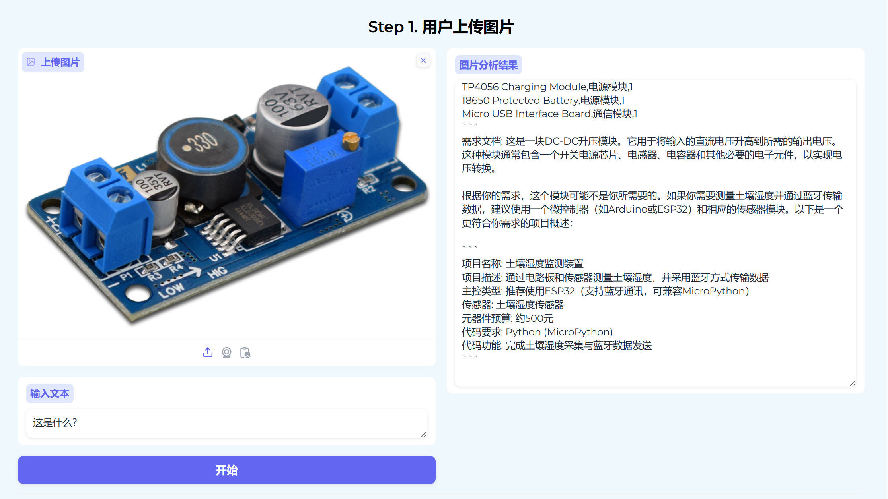
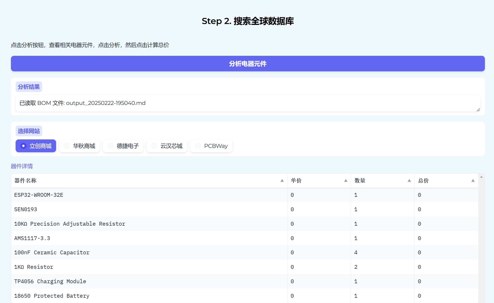
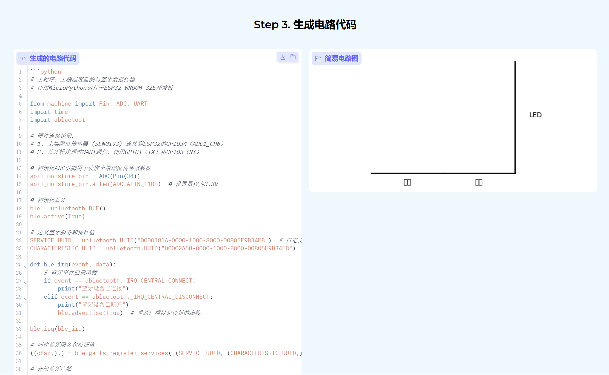
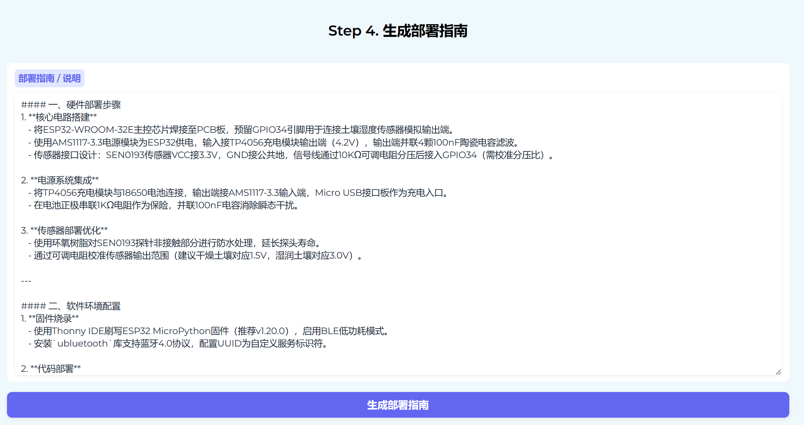
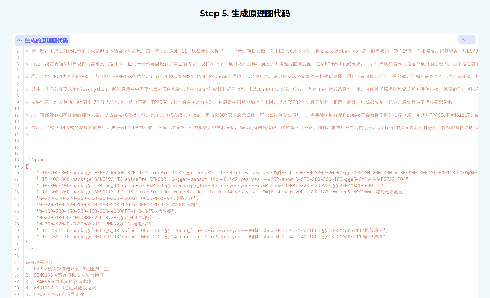
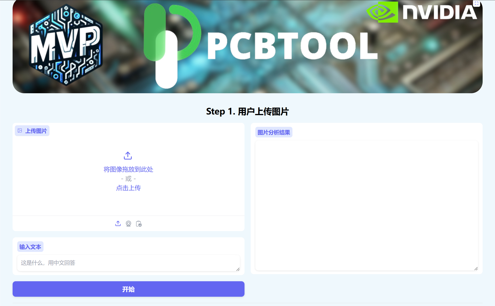

# UI界面设计

我们为本次参赛项目LLM大模型的部署设计了一个美观、易用且功能完善的Web界面。基于Gradio框架的`Blocks`，结合自定义CSS和JavaScript，实现了从基础布局到高级交互的全面优化。下面我将简要介绍本项目 **”PCBTool“** Web 应用的用户界面（UI）设计思路和功能模块。

## 1. 整体布局和风格

界面整体主题为海洋蓝，背景颜色为半透明的浅蓝色，功能模块的界面跟随主题颜色为蓝色，功能按钮呈现深蓝色，字体为 “Microsoft YaHei”，

1. **容器样式**：使用 `.gradio-container` 类设置背景颜色为半透明的浅蓝色，字体为 “Microsoft YaHei”，并添加内边距，使内容与边界有一定间隔，增强视觉舒适度。

2. **背景图片**：我们为本次参赛项目“PCBTool”设置了一个团队横幅。专门设置了一个横幅，如下图所示。画面上元素以此为团队队徽MVP、本次比赛项目名称“PCBTool”以及本次大赛活动的主办方Nvidia的logo。横幅背景为计算芯片和电路图。

   

   该横幅展示在UI界面的顶部，通过 `#background_image` 元素设置背景图片，使其宽度占满整个容器，高度适中，并带有圆角边框，居中显示，提升界面美观度。

3. **界面布局设计**：整体布局根据流程，从上到下依次5个版块，每个模块布局为左右设计，包括以下几个部分：

   - **主界面**：分为左右两栏，左侧为输入区，右侧为输出区。
   - **输入区**：包含图片上传、文本输入和操作按钮。
   - **输出区**：实时显示处理日志和结果。
   - **顶部导航栏**：包含标题和设置按钮。

------

## 2. 各个功能模块

我们按照以下几个原则对项目的5大模块进行设计：

- **美观性**：提升界面视觉效果，使其符合现代UI设计趋势。
- **易用性**：优化交互流程，降低用户学习成本。
- **响应式设计**：确保界面在不同设备上均能良好展示。
- **性能优化**：保证界面流畅运行，提升用户体验。

下面将依次介绍本项目各模块作用以及相应的UI设计。

1. 用户上传图片模块

   - **功能描述**：用户可以在此上传图片，并输入与图片相关的文本描述。点击 “开始” 按钮后，系统会对上传的图片进行分析，并将分析结果显示在 “图片分析结果” 文本框中。
   - **UI 设计体现**：通过`gr.Row`和`gr.Column`布局，将图片上传、文本输入和开始按钮放置在同一行的不同列中，结果显示在另一列。`gr.Image`组件用于上传图片，`gr.Textbox`用于输入文本和显示结果，`gr.Button`用于触发分析操作。同时，使用了类名和元素 ID 进行样式定制，如`elem_classes`和`elem_id`属性。

   

2. 搜索全球数据库模块

   - **功能描述**：用户点击 “分析电器元件” 按钮后，系统会对图片分析结果中的电器元件进行分析，并将分析结果显示在 “分析结果” 文本框中。用户可以选择不同的网站（如立创商城、华秋商城等），系统会根据选择的网站搜索相关的电器元件信息，并显示在 “器件详情” 数据框中。点击 “计算总价” 按钮，可以计算所选器件的总价，并显示在 “总价” 数字框中。
   - **UI 设计体现**：使用多个`gr.Row`和`gr.Column`进行布局，将分析按钮、分析结果文本框、网站选择单选框、器件详情数据框和总价计算按钮等组件进行合理排列。`gr.Button`用于触发分析和计算操作，`gr.Textbox`用于显示分析结果，`gr.Radio`用于选择网站，`gr.Dataframe`用于显示器件详情，`gr.Number`用于显示总价。

   

3. 电路代码生成模块

   - **功能描述**：用户点击 “生成电路” 按钮后，系统会生成相应的电路代码，并显示在 “生成的电路代码” 代码框中，同时生成简易电路图并显示在 “简易电路图” 绘图框中。
   - **UI 设计体现**：通过`gr.Row`将代码输出框和电路图绘图框分为两列，`gr.Code`组件用于显示生成的电路代码，`gr.Plot`组件用于显示简易电路图，`gr.Button`用于触发代码生成操作。

   

4. 部署指南生成模块

   - **功能描述**：用户点击 “生成部署指南” 按钮后，系统会生成项目部署指南，并显示在 “部署指南 / 说明” 文本框中。点击 “朗读部署指南” 按钮，可以将部署指南以语音形式播放。
   - **UI 设计体现**：使用`gr.Column`布局，将部署指南文本框和生成按钮放置在一起。`gr.Textbox`用于显示部署指南，`gr.Button`用于触发生成和朗读操作，`gr.Audio`组件用于播放语音。

   

5. 生成原理图代码模块

   - **功能描述**：用户点击 “生成原理图代码” 按钮后，系统会生成相应的原理图代码，并显示在 “生成的原理图代码” 代码框中。
   - **UI 设计体现**：通过`gr.Row`布局，将原理图代码输出框和生成按钮放置在一起。`gr.Code`组件用于显示生成的原理图代码，`gr.Button`用于触发代码生成操作。

   

------

## 3. 实现细节

### 3.1 相关技术栈

- **前端**：HTML、CSS、JavaScript
- **框架**：Gradio
- **工具**：Font Awesome、Coolors.c  o（配色工具）、PhotoShop

### 3.2 部分核心代码

```python
with gr.Blocks(theme=gr.themes.Soft(), css=css, title=" 电路预测和生成" ) as demo:
    gr.Image(
        value="./src/background.jpg", 
        show_label=False, 
        container=False,
        show_download_button=False,
        show_share_button=False,
        show_fullscreen_button=False,
        elem_id="background_image"
    )
    with gr.Row():
        gr.Markdown("""
                <div style="  border-radius: 10px; text-align: center;">
                    <h2 style="color:#000;">Step 1. 用户上传图片 </h2>
                </div>
                """)
    with gr.Row():
        with gr.Column(scale=1, min_width=300, elem_classes="align-column"): 
            image_input = gr.Image(label="上传图片", type="pil", elem_id="image-input") 
            text_input = gr.Textbox(label="输入文本", placeholder="这是什么，用中文回答", elem_classes="textbox-input") 
            start_button = gr.Button("开始", variant="primary", elem_classes="start-button")             
        with gr.Column(scale=1, min_width=300, elem_classes="align-column"):   
            result_text = gr.Textbox(label="图片分析结果", lines=15, elem_classes="result-text", show_label=True, max_lines=20) 
```

------

## 4. 成果展示

通过以上设计，实现了较好用户友好型交互界面，主界面简洁美观，功能分区清晰，聊天气泡区分明显，输入框交互流畅，加载动画和快捷键提升了用户体验。



------

## 5. 未来优化方向

1. **性能表现**：界面响应迅速，支持高并发请求。移动端适配良好，用户体验一致。
2. **多语言支持**：增加国际化功能，支持多语言界面。
3. **插件扩展**：支持第三方插件，增强功能多样性。
